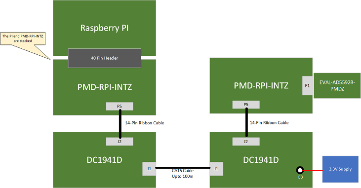
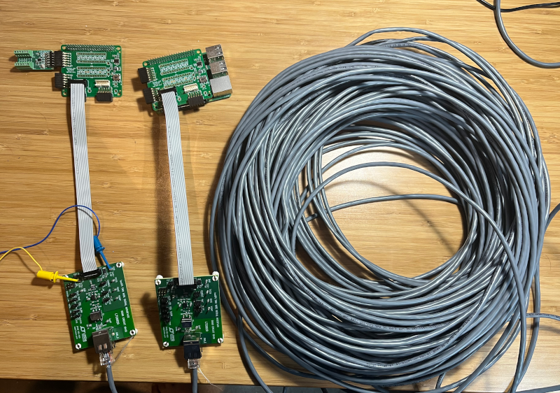

# SPI Exerciser

## Overview
This project provides a simple set of scripts for exercising a SPI bus 
connection between the host interface and device. The intention of these scripts
is to characterize the capabilites and performance of isoSPI and SPI Extension
devices such as:
- Analog Devices [LTC6820](https://www.analog.com/en/products/ltc6820.html) isoSPI Interface
- Analog Devices [LTC4322](https://www.analog.com/en/products/ltc4332.html) SPI Extender

## Operation
The scripts consist of an interface device and exerciser for each run. The 
interface is the physical SPI bus connection on the host device.  The exerciser
utilizes physical hardware, or other means to verify the integrity of the link.

The script will loop through multiple SPI frequencies (based on command line 
options) providing success rates as percentage at each frequency tested.

### Command Line Arguments

| Option | Description | Default |
| --- | --- | --- |
| -e, --exerciser | Which exerciser to use. 'loopback', 'ad5592r', 'adxl355' | Loopback |
| -i, --interface | Which interface to use. 'spidev', 'aardvark' | spidev |
| --start | Starting Frequency in Hz | 100kHz |
| --end   | Ending Frequency in Hz (Inclusive) | 1 MHz |
| --step  | Frequency Step Size in Hz | 50 kHz |
| --delay | Delay (in ms) between Frequency Steps | 0 |
| --debug | Enables verbose debug output | |
| --lbmode | SPI Mode when using Loopback exerciser | 0 |
| --bus | Bus number when using spidev Interface | 0 |
| --cs | Chip select number when using spidev Interface | 0 |

### Interfaces
The following interfaces (host hardware) have been implemented

| Name | Description | Additional Args |
| --- | --- | --- |
| spidev | Access to the Linux spidev interface (i.e. /dev/spi0.0 ) | --bus, --cs |
| aardvark | Access to the Total Phase Aardvark USB SPI/I2C Adapter | |

> **Note:** Due to licensing restrictions of the Aardvark API:
> *The Product must not be placed on any publicly-accessible Internet server including, but not limited to, web servers, ftp servers, and file sharing systems. Instead, a link should be placed to the Total Phase website where the latest versions may be obtained.*
> 
> To use the Aardavark interface, download the [Aardvark Software API](https://www.totalphase.com/products/aardvark-software-api/) from Total Phase, and place 
aardvark.dll (or your OS's equivalent) and aardvark_py.py in the root folder of this project.

### Exercisers
The following exercisers (target hardware) have been implemented

| Name | Description | Additional Args |
| --- | --- | --- |
| loopback | Assumes the MISO and MOSI data is loopbacked | --lbmode |
| ad5592r | Analog Devices [AD5592r](https://www.analog.com/en/products/ad5592r.html) 8-Channel, 12-Bit, Configurable ADC/DAC with On-Chip Reference.  Board: [EVAL-AD5592R-PMDZ](https://www.analog.com/en/design-center/evaluation-hardware-and-software/evaluation-boards-kits/EVAL-AD5592R-PMDZ.html) | |
| adxl355 | Analog Devices [ADXL355](https://www.analog.com/en/products/adxl355.html) Low Noise, Low Drift, Low Power, 3-Axis MEMS Accelerometer. Board: [EVAL-ADXL355-PMDZ](https://www.analog.com/en/design-center/evaluation-hardware-and-software/evaluation-boards-kits/EVAL-ADXL355-PMDZ.html)| |

> **Note:** Due to reclocking and timing considerations, not all isoSPI or
SPI extension devices support looping back MISO and MOSI. Review the part 
datasheet to determine compatibility.

## Example Tests
### Example 1: Raspberry PI + LTC6820 + AD5592r
This example exercises the LTC6820 isoSPI transceiver using a Raspberry PI as
the host processor, and the AD5592r as the target device.

Required Hardware:
- Raspberry PI
    - Recommend running [Kuiper Linux](https://wiki.analog.com/resources/tools-software/linux-software/kuiper-linux) distribution
- [DC1941D](https://www.analog.com/en/design-center/evaluation-hardware-and-software/evaluation-boards-kits/dc1941d.html) LTC6820 Evaluation Board x2
- [PMD-RPI-INTZ](https://www.analog.com/en/design-center/evaluation-hardware-and-software/evaluation-boards-kits/pmd-rpi-intz.html) PMOD/QuikEval/Raspberry PI Hat x2
- [EVAL-AD5592R-PMDZ](https://www.analog.com/en/design-center/evaluation-hardware-and-software/evaluation-boards-kits/EVAL-AD5592R-PMDZ.html) AD5592r PMOD
- CAT5 Cable, Up-to 100m

**Setup Diagram:** 

**70m Cable Setup:** 

Command String:
`python SPI_Exerciser.py -i spidev -e ad5592r --start 100000 --end 2000000 --step 100000`

Results:
| Speed (Hz) | .3m Cable | 8m Cable | 70m Cable |
| --- | --- | --- | --- |
|100000  | 100.00% | 100.00% | 100.00%   |
|200000  | 100.00% | 100.00% | 100.00%   |
|300000  | 100.00% | 100.00% | 100.00%   |
|400000  | 100.00% | 100.00% | 100.00%   |
|500000  | 100.00% | 100.00% | 100.00%   |
|600000  | 100.00% | 100.00% | 100.00%   |
|700000  | 100.00% | 100.00% | 100.00%   |
|800000  | 100.00% | 100.00% | 0.00%  |
|900000  | 100.00% | 100.00% | 0.00%  |
|1000000 | 100.00% | 100.00% | 0.00%  |
|1100000 | 100.00% | 100.00% | 0.00%  |
|1200000 | 100.00% | 100.00% | 0.00%  |
|1300000 | 100.00% | 0.39% | 0.00% |
|1400000 | 0.39%   | 0.39% | 0.00% |
|1500000 | 0.39%   | 0.00% | 0.00%  |
|1600000 | 0.00%   | 0.00% | 0.00%  |
|1700000 | 0.00%   | 0.00% | 0.00%  |
|1800000 | 0.00%   | 0.00% | 0.00%  |
|1900000 | 0.00%   | 0.00% | 0.00%  |
| 2000000  | 0.00%   | 0.00% | 0.00%   |

> The success rate of 100% up through approximately 1.2MHz is in line with the
  LTC6820's datasheet advertised maximum data rates of up 1Mbps